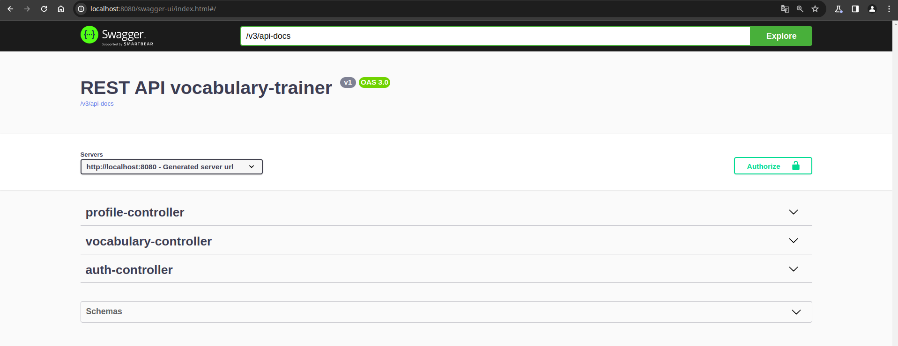

# VOCABULARY-TRAINER

## Приложение-помощник в изучении иностранных слов

### [OpenAPI docs](./docs/api-docs.yaml)

## Требуемое программное обеспечение

* СУБД PostgreSQL
* Java 17 
* Git
* Docker
* Gradle (по желанию)

## Установка LibreTranslate

https://github.com/LibreTranslate/LibreTranslate

## Клонирование приложения
```git clone https://github.com/yufrolov/vocabulary-trainer.git``` 

## Запуск базы данных в Docker контейнере

* Выполни команду: ```cd {путь до директории проекта}/vocabulary-trainer```
* Выполни команду: ```docker-compose up```

## Подключение проекта к базе данных при условии запуска через СУБД PostgreSQL
В application.yml требуется:
* Измени ```url: jdbc:postgresql://localhost:{порт базы данных}/{название базы данных}```
* Измени ```username: {имя пользователя}``` 
* Измени ```password: {пароль пользователя}``` 

## Сборка проекта (Gradle)
* Выполни команду: ```cd {путь до директории проекта}/vocabulary-trainer```
* При условии, что Gradle не установлен:
  + Выполни команду: ```chmod +x gradlew```
  + Выполни команду: ```./gradlew build```
* При условии установленного Gradle выполни команду: ```gradle build```
 
## Запуск приложения
* Выполни команду: ```cd {путь до директории проекта}/vocabulary-trainer/build/libs```
* Выполни команду: ```java -jar vocabulary-trainer-0.0.1-SNAPSHOT.jar```

## Swagger

Для использования swagger требуется перейти на http://localhost:8080/swagger-ui/index.html


